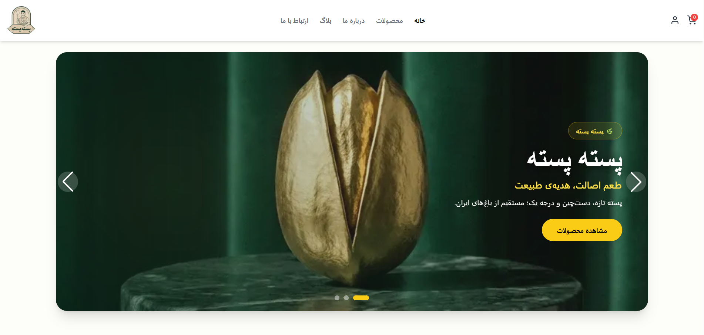

# 🥜 Peste Peste

A modern full-stack e-commerce platform for selling pistachio products, built with **Next.js**, **TypeScript**, **Prisma**, and **PostgreSQL**.

Designed with scalable architecture, secure authentication, responsive RTL interfaces, and a complete admin dashboard for product management.

### 🌐 Live Demo

https://pestepeste.vercel.app/

---

# ✨ Key Features

### 🔐 Authentication

- JWT Authentication
- HttpOnly Cookies
- Password Hashing (bcrypt)
- Protected Routes
- Role-Based Authorization

### 📦 Product Management

- Product CRUD
- Blog CRUD
- Image Upload
- Search & Filtering
- Pagination
- SEO-Friendly Slugs
- Inventory Management

### 🛒 Shopping Experience

- Shopping Cart
- Weight-Based Pricing
- Dynamic Shipping Calculation
- Packaging Cost Calculation
- Secure Server-Side Price Calculation
- Checkout Flow

### ⚙️ Admin Dashboard

- Product Management
- Blog Management
- Store Settings
- Inventory Control

### ✅ Validation

- React Hook Form
- Zod Validation
- Backend Validation
- Centralized Error Handling

---

# 🏗 Architecture

```
React UI
      │
Next.js App Router
      │
Server Actions / API Routes
      │
Service Layer
      │
Prisma ORM
      │
PostgreSQL Database
```

---

# 🛠 Tech Stack

## Frontend

- Next.js App Router
- React
- TypeScript
- Tailwind CSS
- Redux Toolkit
- React Hook Form

## Backend

- Next.js API Routes
- Server Actions
- Prisma ORM
- PostgreSQL

## Storage

- Supabase Storage

## Validation & Security

- Zod
- JWT
- bcrypt
- HttpOnly Cookies

---

# 📁 Project Structure

```
src
│
├── app
│   ├── api
│   ├── components
│   ├── services
│   ├── hooks
│   ├── store
│   ├── lib
│   └── utils
│
├── types
├── validations
└── middleware
```

---

# 🚀 Highlights

- Full-Stack E-commerce Architecture
- Responsive RTL Design
- Admin Dashboard
- Secure Authentication
- Server-Side Business Logic
- Prisma ORM Integration
- PostgreSQL Database
- SEO-Friendly Pages
- Reusable Components
- Scalable Folder Structure

---

# 🔮 Future Improvements

- Online Payment Integration
- Order Tracking
- Product Reviews
- Wishlist
- Analytics Dashboard
- RBAC Permissions

---

# 📸 Screenshots
<<<<<<< HEAD

=======


>>>>>>> db9225fd4672a17333b9d32539acf029f69c91bd
---

# 👨‍💻 Author

**Mostafa Gerayli**

Frontend Developer

- Portfolio: https://my-portfio.vercel.app/
- LinkedIn: https://www.linkedin.com/in/mostafa-gerayli-react/